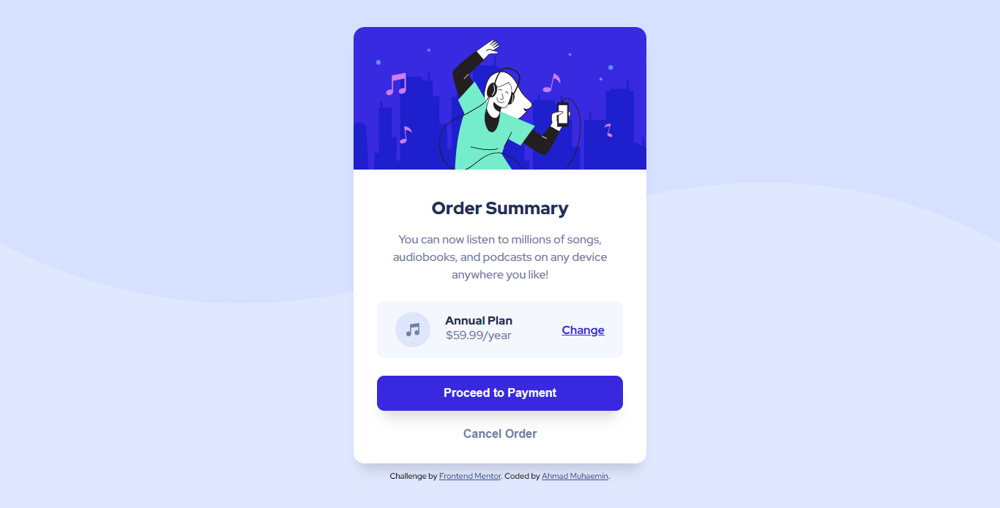

# Frontend Mentor - Order summary card solution

This is a solution to the [Order summary card challenge on Frontend Mentor](https://www.frontendmentor.io/challenges/order-summary-component-QlPmajDUj). Frontend Mentor challenges help you improve your coding skills by building realistic projects.

## Table of contents

- [Overview](#overview)
  - [The challenge](#the-challenge)
  - [Screenshot](#screenshot)
  - [Links](#links)
- [My process](#my-process)
  - [Built with](#built-with)
  - [What I learned](#what-i-learned)
- [Author](#author)

**Note: Delete this note and update the table of contents based on what sections you keep.**

## Overview

### The challenge

Placement of element inside the card is tricky for me.

### Screenshot

- Desktop Preview
  

- Mobile Preview
  

### Links

- Solution URL: [Repository](https://github.com/amuhaemin/order-summary-fementor)
- Live Site URL: [my github.io](https://amuhaemin.github.io/order-summary-fementor/)

## My process

### Built with

- Semantic HTML5 markup
- CSS custom properties
- Flexbox
- CSS Grid
- Mobile-first workflow

### What I learned

In this solutions, I tried to use Grid to positioning the price (plans detail), and flexbox to center the card.

## Author

- Frontend Mentor - [@amuhaemin](https://www.frontendmentor.io/profile/amuhaemin)
- Instagram - [@amuhaemin](https://www.instagram.com/amuhaemin)
